# FlowForge

FlowForge is a distributed background job queue for submitting long-running or resource-intensive tasks through a REST API and processing them asynchronously. It is designed for work such as sending emails, resizing images, generating PDFs, and notifying the caller with an optional webhook after completion.

FlowForge uses durable queue and database storage, but it does not claim true exactly-once execution. The supported production guarantee is at-least-once processing with clear job state, retries, and idempotency-friendly handler design.

## Table of Contents

- [How It Works](#how-it-works)
- [System Overview Diagrams](#system-overview-diagrams)
- [Tech Stack](#tech-stack)
- [Prerequisites](#prerequisites)
- [Setup Steps](#step-1--clone-and-install)
- [How to Test It](#how-to-test-it)
- [Example Webhook Payload](#example-webhook-payload)
- [Architecture](#architecture)
- [Data Flow Diagrams (DFD)](#data-flow-diagrams-dfd)
- [Process Flowcharts](#process-flowcharts)
- [Sequence Diagrams](#sequence-diagrams)
- [API Endpoints](#api-endpoints)
- [Queue and Retry Strategy](#queue-and-retry-strategy)
- [Data Model](#data-model)
- [Deployment Views](#deployment-views)
- [Known Limitations](#known-limitations)
- [Development Commands](#development-commands)

> **Note on diagrams:** all diagrams below are written in [Mermaid](https://mermaid.js.org/) and render natively on GitHub, GitLab, and most Markdown viewers (including VS Code with a Mermaid extension).

## How It Works

- Submit a job via `POST /api/jobs`.
- FlowForge writes the job to PostgreSQL and enqueues it in BullMQ backed by Redis.
- Workers pull jobs in priority order and execute the registered handler for the job's `taskType`.
- On completion or final failure, FlowForge optionally POSTs a webhook callback with the result or error.
- The admin dashboard reads REST APIs and listens for Socket.io `job:updated` events to show real-time progress.

### End-to-End Flow at a Glance

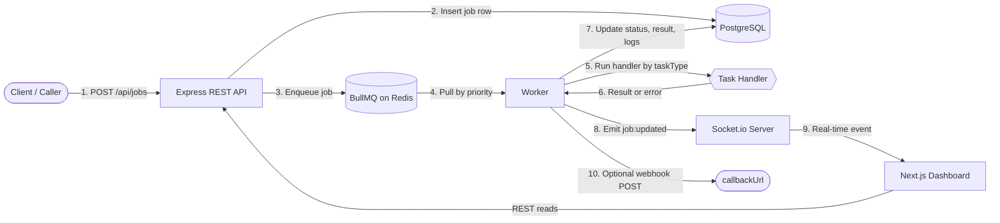
```mermaid
flowchart LR
    C([Client / Caller]) -->|1. POST /api/jobs| API[Express REST API]
    API -->|2. Insert job row| PG[(PostgreSQL)]
    API -->|3. Enqueue job| Q[(BullMQ on Redis)]
    Q -->|4. Pull by priority| W[Worker]
    W -->|5. Run handler by taskType| H{{Task Handler}}
    H -->|6. Result or error| W
    W -->|7. Update status, result, logs| PG
    W -->|8. Emit job:updated| WS[Socket.io Server]
    WS -->|9. Real-time event| D[Next.js Dashboard]
    W -->|10. Optional webhook POST| CB([callbackUrl])
    D -->|REST reads| API
```

## System Overview Diagrams

### System Context

Who and what interacts with FlowForge from the outside.

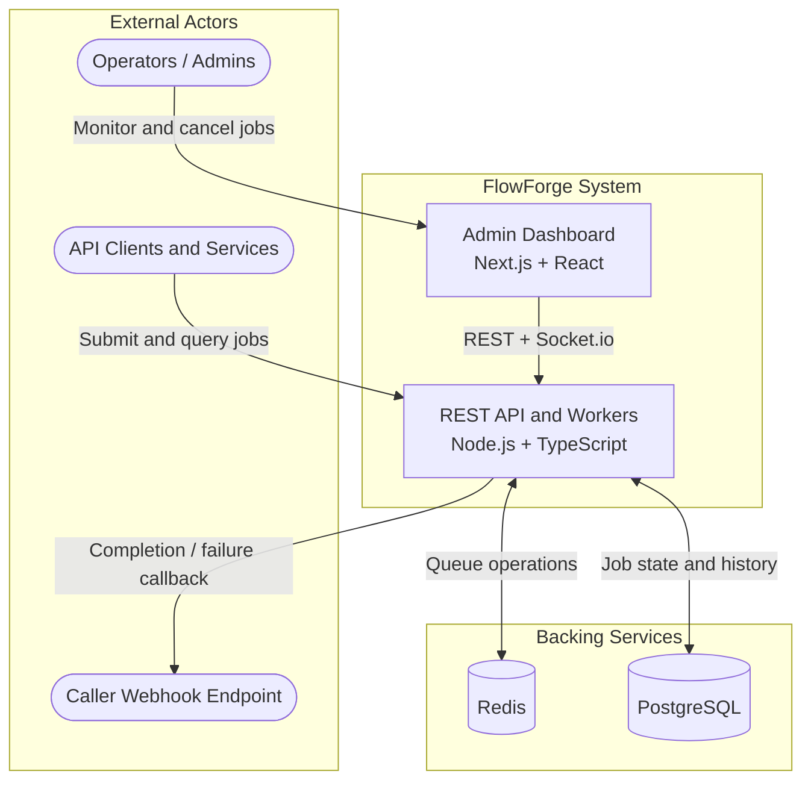
```mermaid
flowchart TB
    subgraph External["External Actors"]
        CL([API Clients and Services])
        OP([Operators / Admins])
        WH([Caller Webhook Endpoint])
    end

    subgraph FF["FlowForge System"]
        direction TB
        APIN[REST API and Workers<br/>Node.js + TypeScript]
        DASH[Admin Dashboard<br/>Next.js + React]
    end

    subgraph Infra["Backing Services"]
        RD[(Redis)]
        PGS[(PostgreSQL)]
    end

    CL -->|Submit and query jobs| APIN
    OP -->|Monitor and cancel jobs| DASH
    DASH -->|REST + Socket.io| APIN
    APIN <-->|Queue operations| RD
    APIN <-->|Job state and history| PGS
    APIN -->|Completion / failure callback| WH
```

### Component Overview

The internal building blocks of the unified Node.js process and the dashboard.

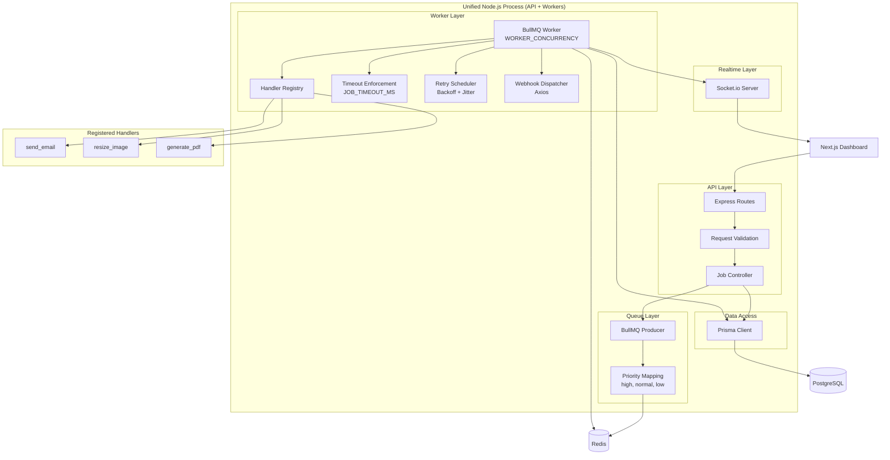
```mermaid
flowchart TB
    subgraph Process["Unified Node.js Process (API + Workers)"]
        direction TB
        subgraph APILayer["API Layer"]
            R[Express Routes]
            V[Request Validation]
            CTRL[Job Controller]
        end

        subgraph QueueLayer["Queue Layer"]
            PROD[BullMQ Producer]
            PRIO[Priority Mapping<br/>high, normal, low]
        end

        subgraph WorkerLayer["Worker Layer"]
            WK[BullMQ Worker<br/>WORKER_CONCURRENCY]
            REG[Handler Registry]
            TO[Timeout Enforcement<br/>JOB_TIMEOUT_MS]
            RET[Retry Scheduler<br/>Backoff + Jitter]
            WHK[Webhook Dispatcher<br/>Axios]
        end

        subgraph Realtime["Realtime Layer"]
            SIO[Socket.io Server]
        end

        subgraph Data["Data Access"]
            PR[Prisma Client]
        end
    end

    subgraph Handlers["Registered Handlers"]
        H1[send_email]
        H2[resize_image]
        H3[generate_pdf]
    end

    R --> V --> CTRL
    CTRL --> PR
    CTRL --> PROD
    PROD --> PRIO
    WK --> REG
    REG --> H1
    REG --> H2
    REG --> H3
    WK --> TO
    WK --> RET
    WK --> WHK
    WK --> PR
    WK --> SIO

    PRIO --> REDIS[(Redis)]
    WK --> REDIS
    PR --> POSTGRES[(PostgreSQL)]
    SIO --> DB[Next.js Dashboard]
    DB --> R
```

## Tech Stack

Backend: Node.js, TypeScript, Express, BullMQ, Redis, PostgreSQL, Prisma, Socket.io, Axios.

Frontend: Next.js, React, Tailwind CSS, Socket.io client, Recharts.

### Technology Map

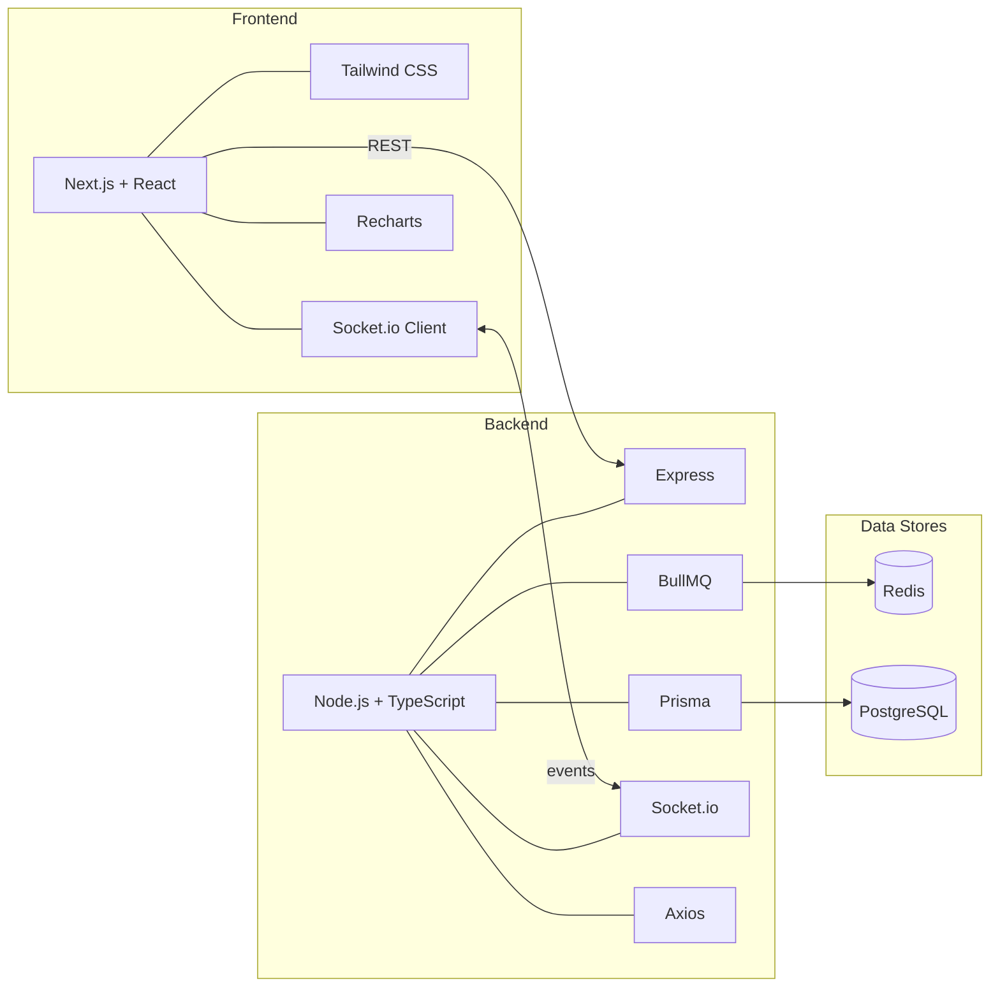
```mermaid
flowchart LR
    subgraph Backend
        N[Node.js + TypeScript]
        E[Express]
        B[BullMQ]
        P[Prisma]
        S[Socket.io]
        A[Axios]
    end
    subgraph Frontend
        NX[Next.js + React]
        T[Tailwind CSS]
        SC[Socket.io Client]
        RC[Recharts]
    end
    subgraph Data["Data Stores"]
        RDS[(Redis)]
        PGD[(PostgreSQL)]
    end

    N --- E
    N --- B
    N --- P
    N --- S
    N --- A
    B --> RDS
    P --> PGD
    NX --- T
    NX --- SC
    NX --- RC
    SC <-->|events| S
    NX -->|REST| E
```

## Prerequisites

- Node.js 18+
- Redis
- PostgreSQL
- Docker and Docker Compose for local development

## Step 1 — Clone and Install

```bash
git clone <your-repo-url> flowforge
cd flowforge
npm install
cd dashboard && npm install
```

## Step 2 — Start Redis and PostgreSQL

```bash
docker-compose up -d
```

## Step 3 — Configure Environment

```bash
cp .env.example .env
```

Review the values in `.env` before running migrations.

## Step 4 — Run Migrations

```bash
npx prisma migrate dev
```

## Step 4 — Start the Server

```bash
npm run dev
```

The server starts at `http://localhost:3000` with workers running.

## Step 5 — Access the Dashboard

```bash
cd dashboard
npm run dev
```

Dashboard runs at `http://localhost:3001`.

### Local Setup Flow

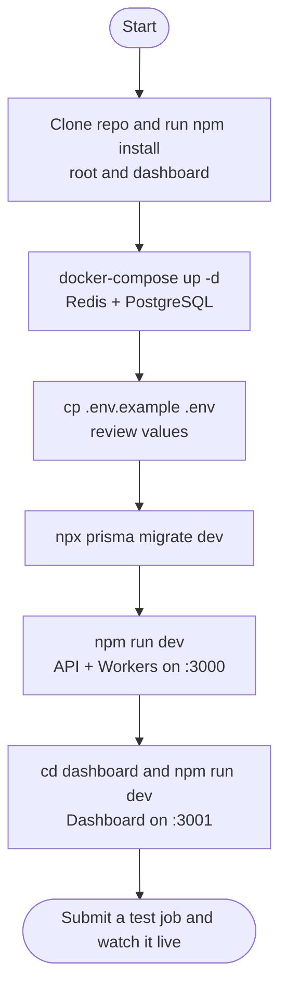
```mermaid
flowchart TD
    A([Start]) --> B[Clone repo and run npm install<br/>root and dashboard]
    B --> C[docker-compose up -d<br/>Redis + PostgreSQL]
    C --> D[cp .env.example .env<br/>review values]
    D --> E[npx prisma migrate dev]
    E --> F[npm run dev<br/>API + Workers on :3000]
    F --> G[cd dashboard and npm run dev<br/>Dashboard on :3001]
    G --> H([Submit a test job and watch it live])
```

## How to Test It

1. Use curl or Postman to POST to `/api/jobs`:

```bash
curl -X POST http://localhost:3000/api/jobs \
  -H "Content-Type: application/json" \
  -d '{
    "taskType": "send_email",
    "payload": { "to": "test@example.com", "subject": "Test", "body": "Hello" },
    "priority": "normal"
  }'
```

2. Use the `jobId` from the response to check status:

```bash
curl http://localhost:3000/api/jobs/{jobId}
```

3. Open the dashboard at `http://localhost:3001` and watch the job progress in real time.

4. Try creating `resize_image` jobs with `"forceFail": true` in the payload to trigger failures and test retry logic.

### Test Walkthrough

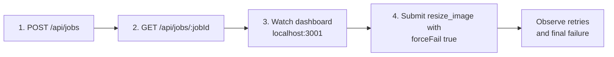
```mermaid
flowchart LR
    T1[1. POST /api/jobs] --> T2[2. GET /api/jobs/:jobId]
    T2 --> T3[3. Watch dashboard<br/>localhost:3001]
    T3 --> T4[4. Submit resize_image with<br/>forceFail true]
    T4 --> T5[Observe retries<br/>and final failure]
```

## Example Webhook Payload

```json
{
  "jobId": "6c2b992d-67e1-4cb5-86db-7687d76d73c2",
  "status": "completed",
  "result": {
    "emailId": "email_6e58d37f-9989-44ff-bd21-f3228839234f",
    "sentAt": "2026-06-10T19:00:00.000Z"
  },
  "error": null
}
```

Failed jobs use `"status": "failed"`, `"result": null`, and an error message.

## Architecture

FlowForge separates job submission, queueing, execution, persistence, and monitoring:

- API: validates requests, creates jobs, lists jobs, returns job details, and handles cancellation.
- Queue: BullMQ stores job work items in Redis and applies priority ordering.
- Workers: execute registered handlers, enforce timeouts, update PostgreSQL, and schedule retries through BullMQ.
- Storage: PostgreSQL stores job history, status, payloads, results, retry metadata, and logs.
- Dashboard: Next.js reads REST endpoints and listens to Socket.io updates for operational monitoring.

The first deployment runs API and workers in one Node.js process. The queue and database boundaries allow splitting API and workers later.

### Layered Architecture

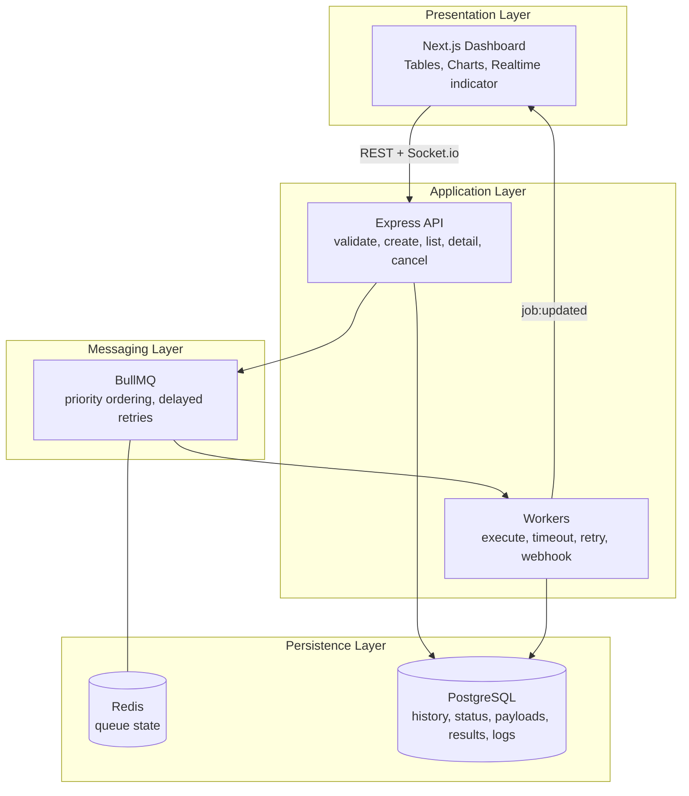
```mermaid
flowchart TB
    subgraph L1["Presentation Layer"]
        UI[Next.js Dashboard<br/>Tables, Charts, Realtime indicator]
    end
    subgraph L2["Application Layer"]
        API[Express API<br/>validate, create, list, detail, cancel]
        WRK[Workers<br/>execute, timeout, retry, webhook]
    end
    subgraph L3["Messaging Layer"]
        BQ[BullMQ<br/>priority ordering, delayed retries]
    end
    subgraph L4["Persistence Layer"]
        RDS[(Redis<br/>queue state)]
        PGD[(PostgreSQL<br/>history, status, payloads, results, logs)]
    end

    UI -->|REST + Socket.io| API
    API --> BQ
    BQ --> WRK
    BQ --- RDS
    API --> PGD
    WRK --> PGD
    WRK -->|job:updated| UI
```
## Data Flow Diagrams (DFD)

### DFD Level 0 — Context Diagram

FlowForge as a single process, with its external entities and the data crossing the boundary.

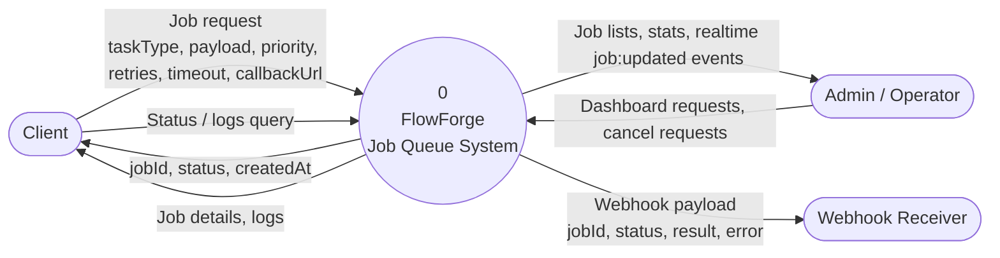
```mermaid
flowchart LR
    CLIENT([Client])
    ADMIN([Admin / Operator])
    CBK([Webhook Receiver])

    FF((0<br/>FlowForge<br/>Job Queue System))

    CLIENT -->|Job request<br/>taskType, payload, priority, retries, timeout, callbackUrl| FF
    FF -->|jobId, status, createdAt| CLIENT
    CLIENT -->|Status / logs query| FF
    FF -->|Job details, logs| CLIENT

    ADMIN -->|Dashboard requests, cancel requests| FF
    FF -->|Job lists, stats, realtime job:updated events| ADMIN

    FF -->|Webhook payload<br/>jobId, status, result, error| CBK
```

### DFD Level 1 — Major Processes and Data Stores

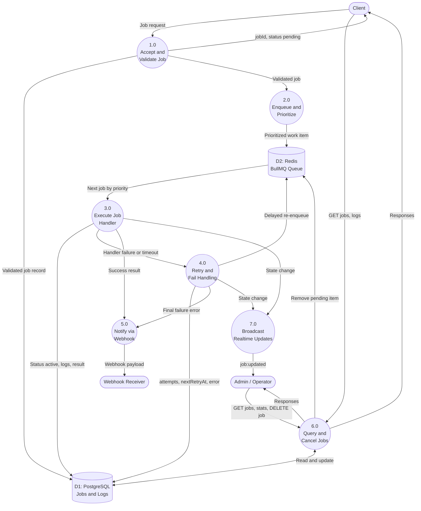
```mermaid
flowchart TB
    CLIENT([Client])
    ADMIN([Admin / Operator])
    CBK([Webhook Receiver])

    P1((1.0<br/>Accept and<br/>Validate Job))
    P2((2.0<br/>Enqueue and<br/>Prioritize))
    P3((3.0<br/>Execute Job<br/>Handler))
    P4((4.0<br/>Retry and<br/>Fail Handling))
    P5((5.0<br/>Notify via<br/>Webhook))
    P6((6.0<br/>Query and<br/>Cancel Jobs))
    P7((7.0<br/>Broadcast<br/>Realtime Updates))

    D1[(D1: PostgreSQL<br/>Jobs and Logs)]
    D2[(D2: Redis<br/>BullMQ Queue)]

    CLIENT -->|Job request| P1
    P1 -->|Validated job record| D1
    P1 -->|jobId, status pending| CLIENT
    P1 -->|Validated job| P2
    P2 -->|Prioritized work item| D2
    D2 -->|Next job by priority| P3
    P3 -->|Status active, logs, result| D1
    P3 -->|Handler failure or timeout| P4
    P4 -->|attempts, nextRetryAt, error| D1
    P4 -->|Delayed re-enqueue| D2
    P3 -->|Success result| P5
    P4 -->|Final failure error| P5
    P5 -->|Webhook payload| CBK
    P3 -->|State change| P7
    P4 -->|State change| P7
    P7 -->|job:updated| ADMIN

    CLIENT -->|GET jobs, logs| P6
    ADMIN -->|GET jobs, stats, DELETE job| P6
    P6 <-->|Read and update| D1
    P6 -->|Remove pending item| D2
    P6 -->|Responses| CLIENT
    P6 -->|Responses| ADMIN
```

### DFD Level 2 — Job Execution (Process 3.0 Expanded)

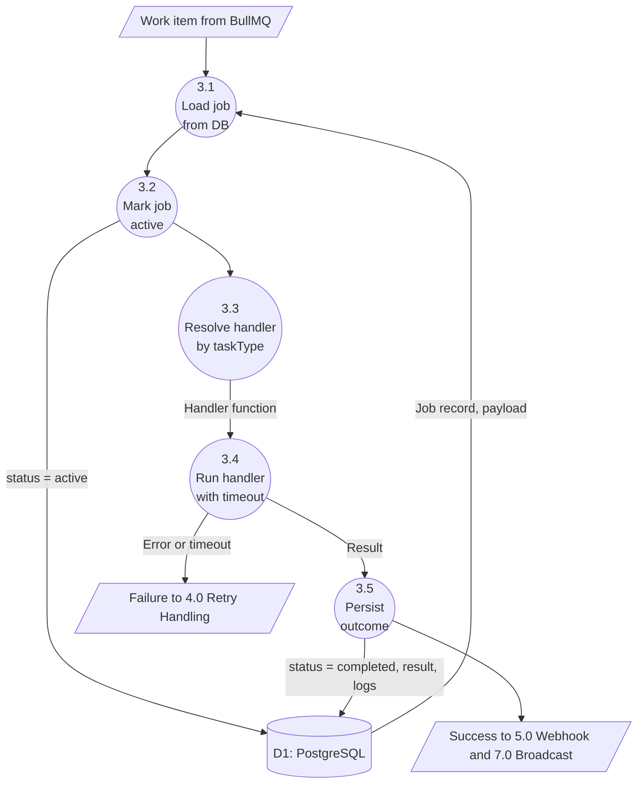
```mermaid
flowchart TB
    IN[/Work item from BullMQ/]
    P31((3.1<br/>Load job<br/>from DB))
    P32((3.2<br/>Mark job<br/>active))
    P33((3.3<br/>Resolve handler<br/>by taskType))
    P34((3.4<br/>Run handler<br/>with timeout))
    P35((3.5<br/>Persist<br/>outcome))

    D1[(D1: PostgreSQL)]
    OUT1[/Success to 5.0 Webhook and 7.0 Broadcast/]
    OUT2[/Failure to 4.0 Retry Handling/]

    IN --> P31
    D1 -->|Job record, payload| P31
    P31 --> P32
    P32 -->|status = active| D1
    P32 --> P33
    P33 -->|Handler function| P34
    P34 -->|Result| P35
    P34 -->|Error or timeout| OUT2
    P35 -->|status = completed, result, logs| D1
    P35 --> OUT1
```

## Process Flowcharts

### Job Submission Flow (`POST /api/jobs`)

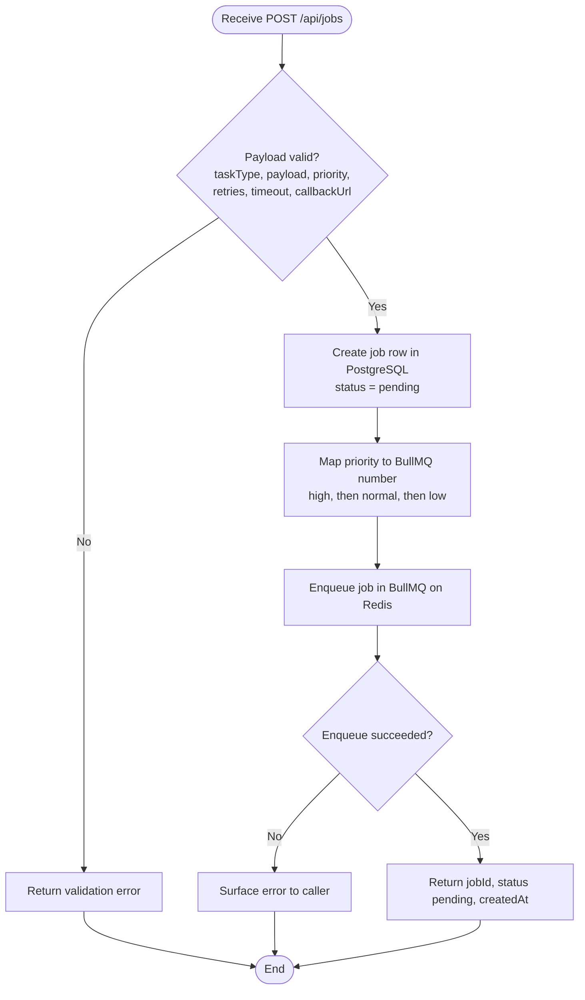
```mermaid
flowchart TD
    A([Receive POST /api/jobs]) --> B{Payload valid?<br/>taskType, payload, priority,<br/>retries, timeout, callbackUrl}
    B -- No --> B1[Return validation error]
    B1 --> Z([End])
    B -- Yes --> C[Create job row in PostgreSQL<br/>status = pending]
    C --> D[Map priority to BullMQ number<br/>high, then normal, then low]
    D --> E[Enqueue job in BullMQ on Redis]
    E --> F{Enqueue succeeded?}
    F -- No --> F1[Surface error to caller]
    F1 --> Z
    F -- Yes --> G[Return jobId, status pending, createdAt]
    G --> Z
```

### Worker Processing Flow

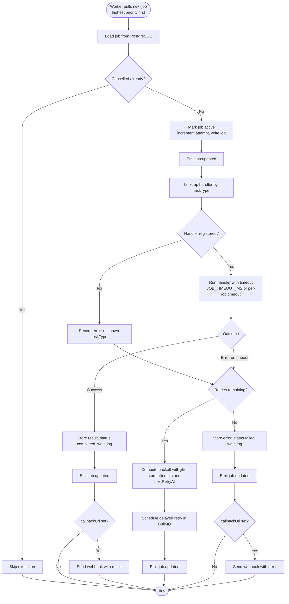
```mermaid
flowchart TD
    A([Worker pulls next job<br/>highest priority first]) --> B[Load job from PostgreSQL]
    B --> C{Cancelled already?}
    C -- Yes --> C1[Skip execution]
    C1 --> Z([End])
    C -- No --> D[Mark job active<br/>increment attempt, write log]
    D --> E[Emit job:updated]
    E --> F[Look up handler by taskType]
    F --> G{Handler registered?}
    G -- No --> G1[Record error: unknown taskType]
    G1 --> R
    G -- Yes --> H[Run handler with timeout<br/>JOB_TIMEOUT_MS or per-job timeout]
    H --> I{Outcome}
    I -- Success --> J[Store result, status completed, write log]
    J --> K[Emit job:updated]
    K --> L{callbackUrl set?}
    L -- Yes --> M[Send webhook with result]
    L -- No --> Z
    M --> Z
    I -- Error or timeout --> R{Retries remaining?}
    R -- Yes --> S[Compute backoff with jitter<br/>store attempts and nextRetryAt]
    S --> T[Schedule delayed retry in BullMQ]
    T --> U[Emit job:updated]
    U --> Z
    R -- No --> V[Store error, status failed, write log]
    V --> W[Emit job:updated]
    W --> X{callbackUrl set?}
    X -- Yes --> Y[Send webhook with error]
    X -- No --> Z
    Y --> Z
```

### Job Lifecycle State Diagram

> Conceptual view of the states described in the API and Known Limitations sections.

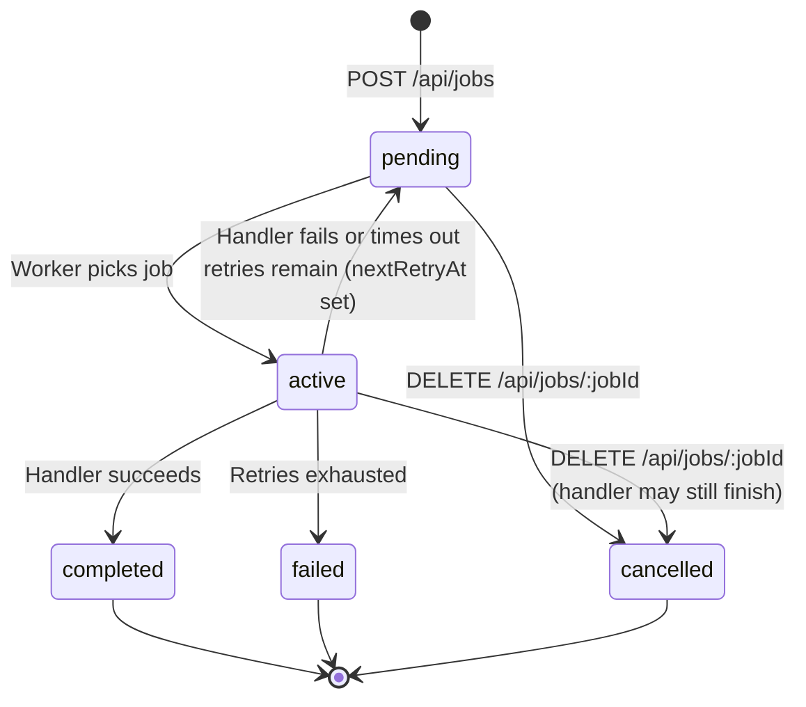
```mermaid
stateDiagram-v2
    [*] --> pending: POST /api/jobs
    pending --> active: Worker picks job
    active --> completed: Handler succeeds
    active --> pending: Handler fails or times out<br/>retries remain (nextRetryAt set)
    active --> failed: Retries exhausted
    pending --> cancelled: DELETE /api/jobs/:jobId
    active --> cancelled: DELETE /api/jobs/:jobId<br/>(handler may still finish)
    completed --> [*]
    failed --> [*]
    cancelled --> [*]
```

### Retry Decision Flow

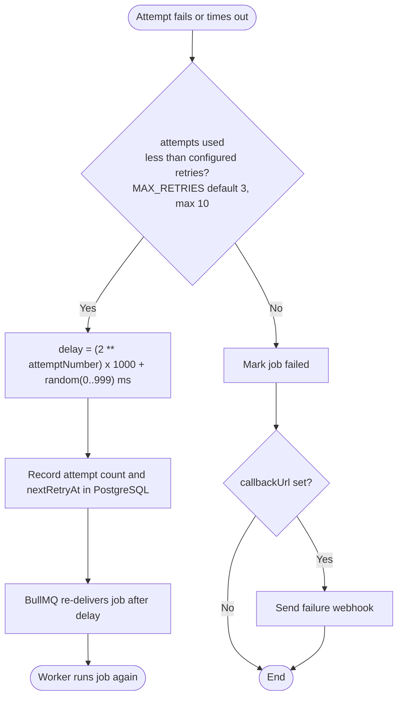
```mermaid
flowchart TD
    A([Attempt fails or times out]) --> B{attempts used<br/>less than configured retries?<br/>MAX_RETRIES default 3, max 10}
    B -- Yes --> C["delay = (2 ** attemptNumber) x 1000 + random(0..999) ms"]
    C --> D[Record attempt count and nextRetryAt in PostgreSQL]
    D --> E[BullMQ re-delivers job after delay]
    E --> F([Worker runs job again])
    B -- No --> G[Mark job failed]
    G --> H{callbackUrl set?}
    H -- Yes --> I[Send failure webhook]
    H -- No --> J([End])
    I --> J
```

### Webhook Delivery Flow

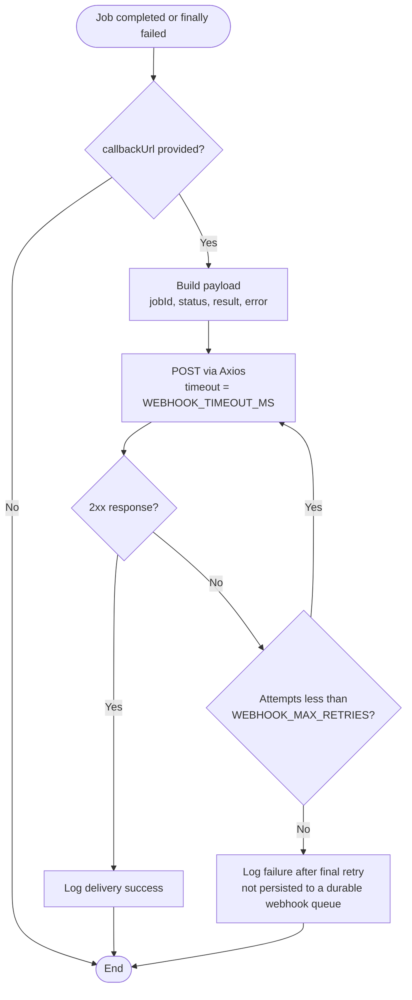
```mermaid
flowchart TD
    A([Job completed or finally failed]) --> B{callbackUrl provided?}
    B -- No --> Z([End])
    B -- Yes --> C[Build payload<br/>jobId, status, result, error]
    C --> D[POST via Axios<br/>timeout = WEBHOOK_TIMEOUT_MS]
    D --> E{2xx response?}
    E -- Yes --> F[Log delivery success]
    F --> Z
    E -- No --> G{Attempts less than<br/>WEBHOOK_MAX_RETRIES?}
    G -- Yes --> D
    G -- No --> H[Log failure after final retry<br/>not persisted to a durable webhook queue]
    H --> Z
```

### Job Cancellation Flow (`DELETE /api/jobs/:jobId`)

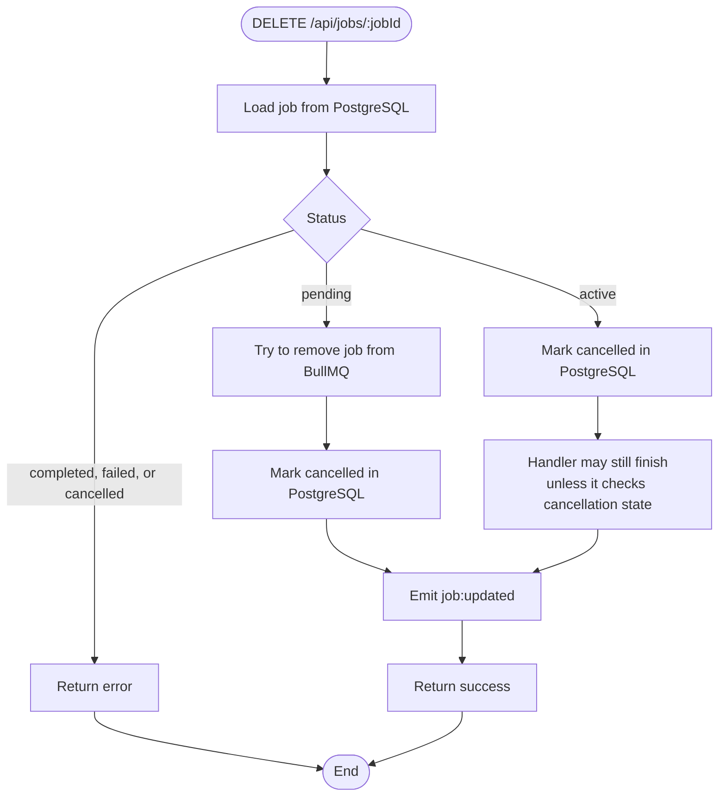
```mermaid
flowchart TD
    A([DELETE /api/jobs/:jobId]) --> B[Load job from PostgreSQL]
    B --> C{Status}
    C -- completed, failed, or cancelled --> D[Return error]
    D --> Z([End])
    C -- pending --> E[Try to remove job from BullMQ]
    E --> F[Mark cancelled in PostgreSQL]
    C -- active --> G[Mark cancelled in PostgreSQL]
    G --> H[Handler may still finish<br/>unless it checks cancellation state]
    F --> I[Emit job:updated]
    H --> I
    I --> J[Return success]
    J --> Z
```

### Priority Queue Ordering

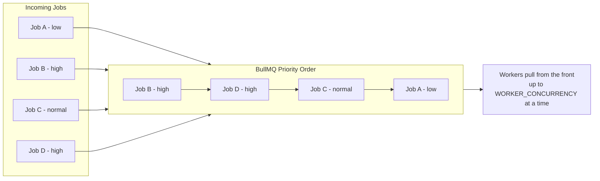
```mermaid
flowchart LR
    subgraph Incoming["Incoming Jobs"]
        J1[Job A - low]
        J2[Job B - high]
        J3[Job C - normal]
        J4[Job D - high]
    end
    subgraph Queue["BullMQ Priority Order"]
        direction LR
        Q1[Job B - high] --> Q2[Job D - high] --> Q3[Job C - normal] --> Q4[Job A - low]
    end
    J1 --> Queue
    J2 --> Queue
    J3 --> Queue
    J4 --> Queue
    Queue --> W[Workers pull from the front<br/>up to WORKER_CONCURRENCY at a time]
```

## Sequence Diagrams

### Successful Job — Submission to Webhook

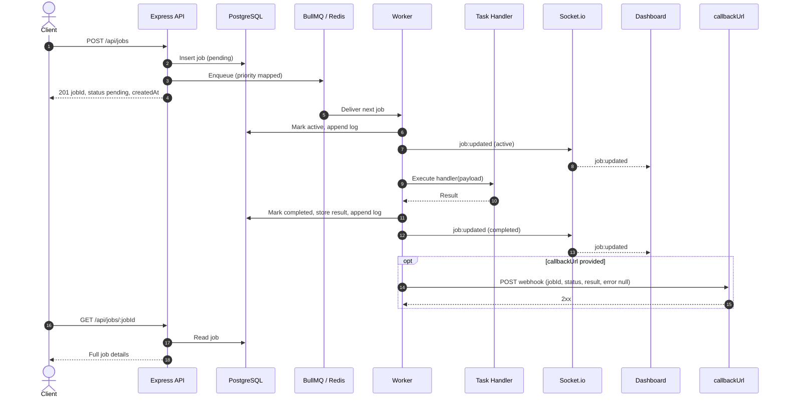
```mermaid
sequenceDiagram
    autonumber
    actor Client
    participant API as Express API
    participant PG as PostgreSQL
    participant Q as BullMQ / Redis
    participant W as Worker
    participant H as Task Handler
    participant WS as Socket.io
    participant UI as Dashboard
    participant CB as callbackUrl

    Client->>API: POST /api/jobs
    API->>PG: Insert job (pending)
    API->>Q: Enqueue (priority mapped)
    API-->>Client: 201 jobId, status pending, createdAt
    Q->>W: Deliver next job
    W->>PG: Mark active, append log
    W->>WS: job:updated (active)
    WS-->>UI: job:updated
    W->>H: Execute handler(payload)
    H-->>W: Result
    W->>PG: Mark completed, store result, append log
    W->>WS: job:updated (completed)
    WS-->>UI: job:updated
    opt callbackUrl provided
        W->>CB: POST webhook (jobId, status, result, error null)
        CB-->>W: 2xx
    end
    Client->>API: GET /api/jobs/:jobId
    API->>PG: Read job
    API-->>Client: Full job details
```

### Failing Job — Retries and Final Failure

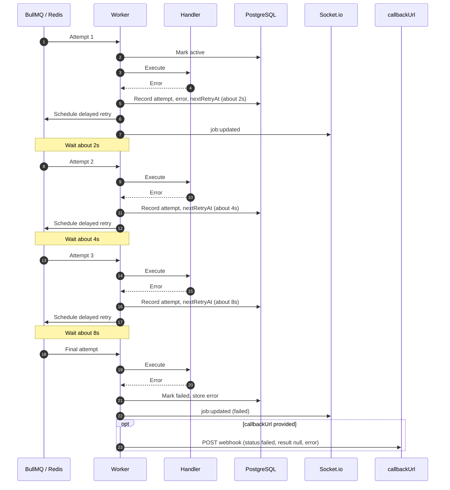
```mermaid
sequenceDiagram
    autonumber
    participant Q as BullMQ / Redis
    participant W as Worker
    participant H as Handler
    participant PG as PostgreSQL
    participant WS as Socket.io
    participant CB as callbackUrl

    Q->>W: Attempt 1
    W->>PG: Mark active
    W->>H: Execute
    H-->>W: Error
    W->>PG: Record attempt, error, nextRetryAt (about 2s)
    W->>Q: Schedule delayed retry
    W->>WS: job:updated
    Note over Q,W: Wait about 2s
    Q->>W: Attempt 2
    W->>H: Execute
    H-->>W: Error
    W->>PG: Record attempt, nextRetryAt (about 4s)
    W->>Q: Schedule delayed retry
    Note over Q,W: Wait about 4s
    Q->>W: Attempt 3
    W->>H: Execute
    H-->>W: Error
    W->>PG: Record attempt, nextRetryAt (about 8s)
    W->>Q: Schedule delayed retry
    Note over Q,W: Wait about 8s
    Q->>W: Final attempt
    W->>H: Execute
    H-->>W: Error
    W->>PG: Mark failed, store error
    W->>WS: job:updated (failed)
    opt callbackUrl provided
        W->>CB: POST webhook (status failed, result null, error)
    end
```

### Real-Time Dashboard Updates

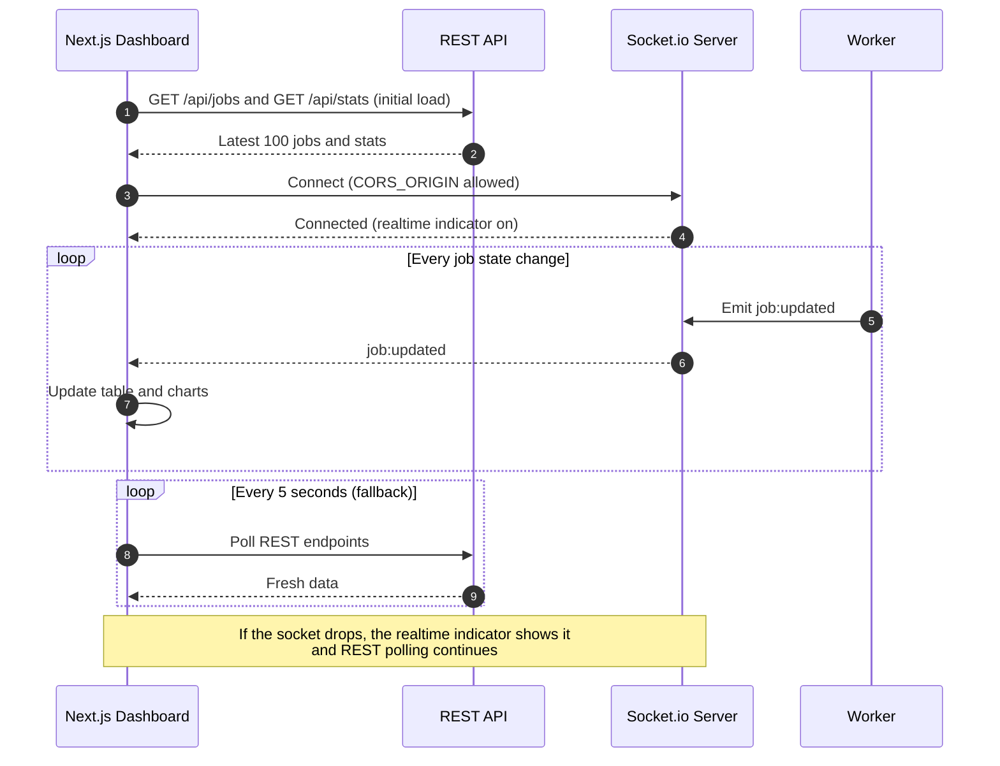
```mermaid
sequenceDiagram
    autonumber
    participant UI as Next.js Dashboard
    participant API as REST API
    participant WS as Socket.io Server
    participant W as Worker

    UI->>API: GET /api/jobs and GET /api/stats (initial load)
    API-->>UI: Latest 100 jobs and stats
    UI->>WS: Connect (CORS_ORIGIN allowed)
    WS-->>UI: Connected (realtime indicator on)
    loop Every job state change
        W->>WS: Emit job:updated
        WS-->>UI: job:updated
        UI->>UI: Update table and charts
    end
    loop Every 5 seconds (fallback)
        UI->>API: Poll REST endpoints
        API-->>UI: Fresh data
    end
    Note over UI,WS: If the socket drops, the realtime indicator shows it<br/>and REST polling continues
```

### Job Cancellation

```mermaid
sequenceDiagram
    autonumber
    actor Admin
    participant UI as Dashboard
    participant API as Express API
    participant Q as BullMQ / Redis
    participant PG as PostgreSQL
    participant WS as Socket.io

    Admin->>UI: Click cancel
    UI->>API: DELETE /api/jobs/:jobId
    API->>PG: Read job status
    alt pending or active
        API->>Q: Attempt to remove queued job
        API->>PG: Set status cancelled
        API->>WS: Emit job:updated
        API-->>UI: Success
    else completed, failed, or cancelled
        API-->>UI: Error
    end
```

## Environment Variables

| Variable              | Description                                             |
| --------------------- | ------------------------------------------------------- |
| `REDIS_URL`           | Redis connection URL for BullMQ                         |
| `DATABASE_URL`        | PostgreSQL connection URL for Prisma                    |
| `WORKER_CONCURRENCY`  | Number of concurrent worker jobs in the unified process |
| `JOB_TIMEOUT_MS`      | Default per-job timeout in milliseconds                 |
| `MAX_RETRIES`         | Default retry count after the first attempt, max 10     |
| `WEBHOOK_TIMEOUT_MS`  | Axios timeout for webhook calls                         |
| `WEBHOOK_MAX_RETRIES` | Maximum webhook delivery attempts                       |
| `PORT`                | Backend HTTP port                                       |
| `NODE_ENV`            | Runtime mode                                            |
| `CORS_ORIGIN`         | Dashboard origin allowed by API and Socket.io           |

### Where Each Variable Applies

```mermaid
flowchart LR
    subgraph Config[".env"]
        V1[REDIS_URL]
        V2[DATABASE_URL]
        V3[WORKER_CONCURRENCY]
        V4[JOB_TIMEOUT_MS]
        V5[MAX_RETRIES]
        V6[WEBHOOK_TIMEOUT_MS]
        V7[WEBHOOK_MAX_RETRIES]
        V8[PORT]
        V9[NODE_ENV]
        V10[CORS_ORIGIN]
    end
    V1 --> Q[BullMQ Queue and Workers]
    V2 --> P[Prisma / PostgreSQL]
    V3 --> W[Worker concurrency]
    V4 --> W
    V5 --> R[Retry policy]
    V6 --> WH[Webhook dispatcher]
    V7 --> WH
    V8 --> A[Express HTTP server]
    V9 --> A
    V10 --> A
    V10 --> S[Socket.io server]
```

## API Endpoints

### `POST /api/jobs`

Request:

```json
{
  "taskType": "send_email",
  "payload": {
    "to": "user@example.com",
    "subject": "Hello",
    "body": "Message"
  },
  "callbackUrl": "https://example.com/webhook",
  "priority": "normal",
  "retries": 3,
  "timeout": 30000
}
```

Response:

```json
{
  "jobId": "6c2b992d-67e1-4cb5-86db-7687d76d73c2",
  "status": "pending",
  "createdAt": "2026-06-10T19:00:00.000Z"
}
```

### `GET /api/jobs`

Returns the latest 100 jobs. Optional query parameters: `taskType`, `status`, `from`, `to`.

### `GET /api/jobs/:jobId`

Returns full job status, payload, result, error, retry metadata, and timestamps.

### `GET /api/jobs/:jobId/logs`

Returns job log entries in chronological order.

### `DELETE /api/jobs/:jobId`

Cancels a pending job when BullMQ can remove it and marks pending or active jobs as `cancelled` in PostgreSQL. Completed, failed, and already cancelled jobs return an error.

### `GET /api/stats`

Returns queue counts, success rate, seven-day completion/failure aggregates, active worker count, and uptime.

### API Route Map

```mermaid
flowchart LR
    CL([Client / Dashboard]) --> R{Express Router}
    R -->|POST /api/jobs| E1[Create and enqueue job]
    R -->|GET /api/jobs| E2[List latest 100 jobs<br/>filters: taskType, status, from, to]
    R -->|GET /api/jobs/:jobId| E3[Job details]
    R -->|GET /api/jobs/:jobId/logs| E4[Chronological logs]
    R -->|DELETE /api/jobs/:jobId| E5[Cancel job]
    R -->|GET /api/stats| E6[Queue counts, success rate,<br/>7-day aggregates, workers, uptime]
    E1 --> PG[(PostgreSQL)]
    E1 --> RD[(Redis / BullMQ)]
    E2 --> PG
    E3 --> PG
    E4 --> PG
    E5 --> PG
    E5 --> RD
    E6 --> PG
    E6 --> RD
```

## Queue and Retry Strategy

BullMQ stores queued work in Redis. FlowForge maps priorities to BullMQ priority numbers with high priority first, then normal, then low.

Retries use exponential backoff with jitter:

```text
(2 ** attemptNumber) * 1000 + random(0..999)
```

Attempt 1 waits about 2 seconds, attempt 2 about 4 seconds, and attempt 3 about 8 seconds. PostgreSQL records attempt counts and `nextRetryAt` for visibility.

## Data Model

> Conceptual entity view based on what PostgreSQL is documented to store: job history, status, payloads, results, retry metadata, and logs. Field names are illustrative; refer to `prisma/schema.prisma` for the authoritative schema.

```mermaid
erDiagram
    JOB ||--o{ JOB_LOG : "has"
    JOB {
        string id PK "jobId (UUID)"
        string taskType
        json payload
        string status "pending, active, completed, failed, cancelled"
        string priority "high, normal, low"
        json result
        string error
        string callbackUrl
        int attempts "retry metadata"
        int maxRetries
        int timeout
        datetime nextRetryAt
        datetime createdAt
        datetime updatedAt
    }
    JOB_LOG {
        string id PK
        string jobId FK
        string message
        datetime createdAt
    }
```
## Known Limitations

- Processing is at-least-once. Handlers must be idempotent if duplicate side effects are unacceptable.
- Jobs that timeout may continue executing internally because JavaScript cannot safely kill arbitrary in-flight async work.
- Active jobs can be marked cancelled, but the current handler may still finish if it does not check cancellation state.
- Webhook delivery failures after final retry are logged but not persisted into a durable webhook retry queue.
- Dashboard socket connection loss is visible through the realtime indicator; REST polling still refreshes every five seconds.
- The first version runs API and workers in one process. Multi-server deployments should split API and workers and add shared event broadcasting.

## Development Commands

```bash
npm run typecheck
npm run build
npm test
cd dashboard && npm run typecheck
cd dashboard && npm run build
```
